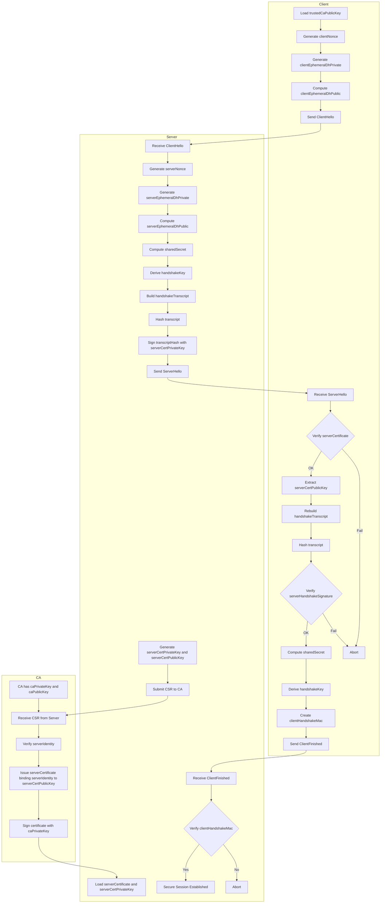

# Public Key Certification & TLS Handshake Flow

---

## Glossary

### Entities

| Term | Description |
|------|-------------|
| **CA (Certificate Authority)** | A trusted third party that verifies a server's identity and issues a certificate by signing the server's public key with the CA's private key. |
| **Server** | Performs a TLS handshake with the client. Presents a CA-issued certificate to prove its identity. |
| **Client** | Initiates a secure channel with the server. Holds the CA's public key in its trust store in advance. |

---

### Keys & Certificates

| Term | Description |
|------|-------------|
| **caPrivateKey** | The CA's private key. Used to sign server certificates. Must never be exposed externally. |
| **caPublicKey** | The CA's public key. Used by the client to verify the signature on the server certificate. Pre-distributed in OS/browser trust stores. |
| **serverCertPrivateKey** | The server's long-term private key paired with the certificate's public key. Used to sign the handshake transcript, proving the server is the legitimate owner of the certificate. |
| **serverCertPublicKey** | The server's long-term public key embedded in the certificate. Used by the client to verify the server's handshake signature. |
| **serverCertificate** | The X.509 certificate issued by the CA. Binds `serverIdentity` and `serverCertPublicKey` together under a signature made with `caPrivateKey`. Allows the client to trust both the server's identity and its public key simultaneously. |
| **serverIdentity** | Identity information that identifies the server, typically the domain name (CN/SAN). Included in the CSR, verified by the CA, and bound into the issued certificate. The client checks that the certificate's serverIdentity matches the domain it connected to. |
| **trustedCaPublicKey** | The CA public key held by the client in its trust store. The starting point for verifying the server certificate. |

---

### CSR (Certificate Signing Request)

| Term | Description |
|------|-------------|
| **CSR** | A signed request structure submitted by the server to the CA to request certificate issuance. Contains `serverCertPublicKey` and server identity information (e.g., domain name), and is self-signed with `serverCertPrivateKey`. |

---

### Ephemeral Diffie-Hellman (ECDHE/DHE)

| Term | Description |
|------|-------------|
| **generator** | A public DH group parameter used as the base in `modPow`. Both parties use the same value. In real TLS with ECDHE, this corresponds to the elliptic curve base point G. |
| **primeModulus** | A public large prime that serves as the modulus in `modPow`. Constrains the result to a finite field, ensuring the hardness of the discrete logarithm problem. |
| **modPow(base, exp, mod)** | Modular exponentiation: computes `base^exp mod mod` efficiently. In DH, `modPow(generator, privateKey, primeModulus)` produces the public value, and `modPow(peerPublic, myPrivate, primeModulus)` produces the shared secret. The discrete logarithm problem makes it infeasible to reverse-compute the private key from the public value. |
| **serverEphemeralDhPrivate** | A fresh ephemeral DH private key generated by the server for each handshake. Discarded after the session ends, ensuring Forward Secrecy. |
| **serverEphemeralDhPublic** | The server-side DH public value: `modPow(generator, serverEphemeralDhPrivate, primeModulus)`. Sent to the client in ServerHello. |
| **clientEphemeralDhPrivate** | A fresh ephemeral DH private key generated by the client for each handshake. |
| **clientEphemeralDhPublic** | The client-side DH public value: `modPow(generator, clientEphemeralDhPrivate, primeModulus)`. Sent to the server in ClientHello. |
| **sharedSecret** | The identical secret value computed independently by both parties via DH key exchange: `modPow(peerEphemeralDhPublic, myEphemeralDhPrivate, primeModulus)`. Never transmitted over the network. |

---

### Nonces

| Term | Description |
|------|-------------|
| **clientNonce** | A random value generated by the client using `SecureRandom` at the time of ClientHello. Prevents replay attacks and serves as key derivation material. |
| **serverNonce** | A random value generated by the server using `SecureRandom` at the time of ServerHello. Used together with `clientNonce` as key derivation material. |

---

### Transcript & Signatures

| Term | Description |
|------|-------------|
| **handshakeTranscript** | A byte sequence formed by concatenating `clientNonce \|\| serverNonce \|\| clientEphemeralDhPublic \|\| serverEphemeralDhPublic`. Represents the complete context of the handshake. |
| **SHA-256** | A one-way hash function that maps arbitrary input to a fixed 256-bit digest. Used as `transcriptHash = SHA-256(handshakeTranscript)`. It is irreversible and exhibits the avalanche effect: any small change in input produces a completely different output. |
| **transcriptHash** | `SHA-256(handshakeTranscript)`. Used as input for both the signature and the MAC computation. |
| **Sign(data, privateKey)** | An asymmetric signing operation. Signs data with a private key to produce a signature value that can only be verified with the corresponding public key, proving that only the private key holder could have produced it. Used in two places: `Sign(tbsCert, caPrivateKey)` by the CA, and `Sign(transcriptHash, serverCertPrivateKey)` by the server. |
| **serverHandshakeSignature** | `Sign(transcriptHash, serverCertPrivateKey)`. The server's signature over the handshake context. The client verifies this using `serverCertPublicKey` to confirm that the server is the legitimate owner of the certificate. |

---

### Key Derivation & MAC

| Term | Description |
|------|-------------|
| **handshakeKey** | A symmetric key derived via `KDF(sharedSecret, clientNonce, serverNonce)`. Used to authenticate the handshake Finished message. |
| **KDF (Key Derivation Function)** | A function that takes a secret value (sharedSecret) and nonces as input and produces a cryptographically secure symmetric key. Real TLS uses HKDF (HMAC-based KDF). |
| **clientHandshakeMac** | `HMAC(handshakeKey, transcriptHash)`. Included by the client in the ClientFinished message. The server recomputes this value and checks for equality to verify handshake integrity. |
| **HMAC** | Hash-based Message Authentication Code. Combines a shared symmetric key with a hash function to guarantee both message integrity and authentication simultaneously. |

---

### Messages

| Term | Description |
|------|-------------|
| **ClientHello** | Client → Server. Contains `clientNonce` and `clientEphemeralDhPublic`. The first message that initiates the handshake. |
| **ServerHello** | Server → Client. Contains `serverNonce`, `serverEphemeralDhPublic`, `serverCertificate`, and `serverHandshakeSignature`. |
| **ClientFinished** | Client → Server. Contains `clientHandshakeMac`. Signals the completion of the client-side handshake. |

---

### Forward Secrecy

| Term | Description |
|------|-------------|
| **Forward Secrecy** | The property that guarantees past session traffic cannot be decrypted even if the server's long-term private key (`serverCertPrivateKey`) is later compromised. Achieved by generating a fresh ephemeral DH key pair per session and discarding it after the session ends. |

---

## Flow Chart



---

## Code Flow

### 0) Common Data Structures (Message Schemas)

```
ClientHello {
  clientNonce: bytes32
  clientEphemeralDhPublic: BigInt
}

ServerHello {
  serverNonce: bytes32
  serverEphemeralDhPublic: BigInt
  serverCertificate: bytes           // X.509 DER/PEM bytes
  serverHandshakeSignature: bytes
}

ClientFinished {
  clientHandshakeMac: bytes          // HMAC(handshakeKey, transcriptHash)
}
```

---

### 1) CA Code Flow (Offline / Pre-issuance)

The CA is assumed to already hold its own key pair (`caPrivateKey`, `caPublicKey`).

```
function issueServerCertificate(serverIdentity, serverCertPublicKey):
    tbs = buildX509TbsCertificate(
        subject          = serverIdentity,       // e.g. "example.com"
        subjectPublicKey = serverCertPublicKey,
        issuer           = "MyCourseCA",
        validity         = (notBefore, notAfter),
        extensions       = { ... }               // can be minimized for course purposes
    )

    certSignature     = sign(tbs, caPrivateKey)
    serverCertificate = assembleX509Certificate(tbs, certSignature)
    return serverCertificate
```

> The certificate format and validation model is based on the X.509 profile defined in RFC 5280.

---

### 2) Server Code Flow (Runtime)

#### 2-1) Server Startup (Boot-time) Preparation

Load the long-term identity key material that the server must hold.

```
serverCertificate    = loadFile("server.crt")   // X.509 certificate signed by CA
serverCertPrivateKey = loadFile("server.key")   // private key paired with the certificate's public key

// Public DH parameters (use well-known fixed values, e.g. MODP group)
primeModulus = RFC3526_GROUP_14_PRIME
generator    = 2
```

> RFC 3526 defines well-known MODP DH groups (large primes with `generator=2`).

#### 2-2) Receive ClientHello → Send ServerHello

```
function onClientHello(msg: ClientHello):
    clientNonce             = msg.clientNonce
    clientEphemeralDhPublic = msg.clientEphemeralDhPublic

    // (1) Generate fresh ephemeral DH key pair for this session (Forward Secrecy)
    serverEphemeralDhPrivate = secureRandomBigInt(1..primeModulus-2)
    serverEphemeralDhPublic  = modPow(generator, serverEphemeralDhPrivate, primeModulus)

    // (2) Generate server nonce
    serverNonce = secureRandomBytes(32)

    // (3) Compute shared secret and derive handshake key before sending ServerHello
    //     Must be completed in advance so the encrypted channel is immediately available
    sharedSecret = modPow(clientEphemeralDhPublic, serverEphemeralDhPrivate, primeModulus)
    handshakeKey = HKDF_Extract_And_Expand(
        ikm    = sharedSecretBytes(sharedSecret),
        salt   = concat(clientNonce, serverNonce),
        info   = "handshake key",
        outLen = 32
    )

    // (4) Build handshake transcript (the data to be signed)
    handshakeTranscript =
        encode(clientNonce)
      + encode(serverNonce)
      + encode(clientEphemeralDhPublic)
      + encode(serverEphemeralDhPublic)

    // (5) Authenticate the server: sign the transcript to prove ownership of the certificate
    //     This is the same idea as TLS 1.3 CertificateVerify
    transcriptHash           = SHA256(handshakeTranscript)
    serverHandshakeSignature = sign(transcriptHash, serverCertPrivateKey)

    // (6) Send ServerHello
    send(ServerHello{
        serverNonce,
        serverEphemeralDhPublic,
        serverCertificate,
        serverHandshakeSignature
    })
```

> HKDF (Extract/Expand) is defined in RFC 5869.

#### 2-3) Receive ClientFinished → Verify

```
function onClientFinished(msg: ClientFinished):
    expectedMac = HMAC(handshakeKey, transcriptHash)

    if msg.clientHandshakeMac != expectedMac:
        abort("handshake mac mismatch")

    // From this point, application data processing is permitted
    acceptSecureSession()
```

---

### 3) Client Code Flow (Runtime)

#### 3-1) Client Startup Preparation

```
// Load CA public key (or root certificate) from trust store
trustedCaPublicKey = loadFile("course-ca-public.key")

primeModulus = RFC3526_GROUP_14_PRIME
generator    = 2
```

#### 3-2) Build and Send ClientHello

```
function startHandshake():
    clientNonce = secureRandomBytes(32)

    clientEphemeralDhPrivate = secureRandomBigInt(1..primeModulus-2)
    clientEphemeralDhPublic  = modPow(generator, clientEphemeralDhPrivate, primeModulus)

    send(ClientHello{
        clientNonce,
        clientEphemeralDhPublic
    })
```

#### 3-3) Receive ServerHello → Verify Certificate and Signature → Derive Keys

```
function onServerHello(msg: ServerHello):
    serverNonce              = msg.serverNonce
    serverEphemeralDhPublic  = msg.serverEphemeralDhPublic
    serverCertificate        = msg.serverCertificate
    serverHandshakeSignature = msg.serverHandshakeSignature

    // (1) Parse certificate and verify CA signature
    //     On success, serverCertPublicKey is established as trustworthy
    //     X.509 certificate validation model is defined in RFC 5280
    serverCertPublicKey = verifyAndExtractPublicKey(
        certificateBytes   = serverCertificate,
        trustedCaPublicKey = trustedCaPublicKey
    )  // abort on failure

    // (2) Rebuild handshake transcript
    handshakeTranscript =
        encode(clientNonce)
      + encode(serverNonce)
      + encode(clientEphemeralDhPublic)
      + encode(serverEphemeralDhPublic)

    transcriptHash = SHA256(handshakeTranscript)

    // (3) Verify the server's signature over the transcript
    //     Same concept as TLS 1.3 CertificateVerify
    if !verifySignature(transcriptHash, serverHandshakeSignature, serverCertPublicKey):
        abort("server handshake signature invalid")

    // (4) Compute shared secret and derive handshake key after successful authentication
    sharedSecret = modPow(serverEphemeralDhPublic, clientEphemeralDhPrivate, primeModulus)
    handshakeKey = HKDF_Extract_And_Expand(
        ikm    = sharedSecretBytes(sharedSecret),
        salt   = concat(clientNonce, serverNonce),
        info   = "handshake key",
        outLen = 32
    )

    // (5) Compute and send Finished MAC
    clientHandshakeMac = HMAC(handshakeKey, transcriptHash)
    send(ClientFinished{ clientHandshakeMac })
```
